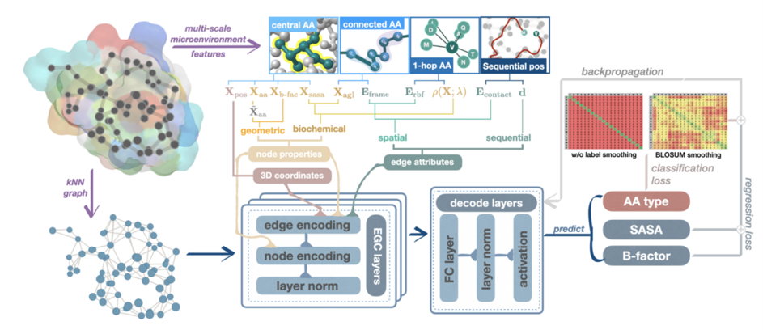

<!-- Improved compatibility of back to top link: See: https://github.com/bzho3923/ProtLGN/pull/73 -->
<a name="readme-top"></a>

<!-- PROJECT LOGO -->
<div align="left">
  <h1 align="left">ProtLGN</h1>

  <p align="left">
    <h2>Protein Engineering with Lightweight Graph Denoising Neural Networks</h2>
    <br />
    <a href="https://github.com/bzho3923/ProtLGN"><strong>Explore the docs »</strong></a>
    <br />
    <br />
    <a href="https://github.com/bzho3923/ProtLGN">View Demo</a>
    ·
    <a href="https://github.com/bzho3923/ProtLGN/issues">Report Bug</a>
    ·
    <a href="https://github.com/bzho3923/ProtLGN/issues">Request Feature</a>
  </p>
</div>


<!-- ABOUT THE PROJECT -->
## About The Project

We design ProtLGN..

<a href="https://github.com/bzho3923/ProtLGN">
    
  </a>

<p align="right">(<a href="#readme-top">back to top</a>)</p>


<!-- GETTING STARTED -->
## Getting Started

Please follow these simple example steps to get start! 😊

### Prerequisites

see `requirements.txt` for more detail.

### Pre-train ProtLGN

#### Step 1: get raw dataset

We use the dataset frmo `CATH 4.2`, you can download from https://www.cathdb.info/.

```sh
cd <your dir>
wget 
mkdir -p data/cath_k10/raw
```

#### Step 2: build graph dataset

see `script/build_cath_dataset.sh`

#### Step 3: run pre-train

see `run_pretrain.sh`

### Zero-shot prediction for mutant sequences

You can use our checkpoint for zero-shot inference.


#### Step 1: Prepare mutant dataset

data

|—— eval_dataset

|——|—— DATASET

|——|——|—— Protein1

|——|——|——|—— Protein1.tsv (DMS file)

|——|——|——|—— Protein1.pdb (pdb file)

|——|——|——|—— Protein1.fasta (sequence)

|——|——|—— Protein2

|——|——|——|...

see `script/build_mutant_dataset.sh`

#### Step 2: Zero-shot

see `script/mutant_predict.sh`

<!-- CONTRIBUTING -->
## Contributing

Please cite our papaer:


<p align="right">(<a href="#readme-top">back to top</a>)</p>


<!-- LICENSE -->
## License

Distributed under the MIT License. See `LICENSE.txt` for more information.

<p align="right">(<a href="#readme-top">back to top</a>)</p>


