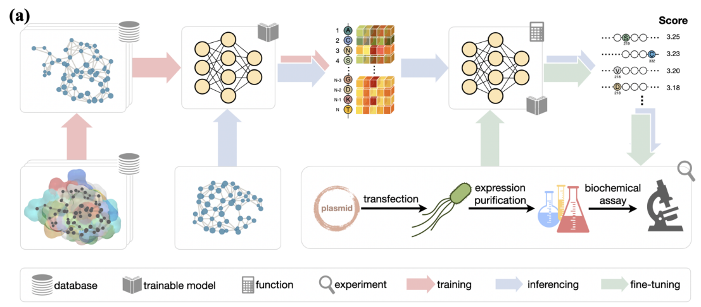

<!-- Improved compatibility of back to top link: See: https://github.com/bzho3923/ProtLGN/pull/73 -->
<a name="readme-top"></a>
<!-- PROJECT LOGO -->
<div align="left">
  <h1 align="left">ProtLGN</h1>

  <p align="left">
    <h2>Protein Engineering with Lightweight Graph Denoising Neural Networks</h2>
    <br />
    <a href="https://github.com/bzho3923/ProtLGN"><strong>Explore the docs »</strong></a>
    <br />
    <br />
    <a href="https://github.com/bzho3923/ProtLGN">View Demo</a>
    ·
    <a href="https://github.com/bzho3923/ProtLGN/issues">Report Bug</a>
    ·
    <a href="https://github.com/bzho3923/ProtLGN/issues">Request Feature</a>
  </p>
</div>

<!-- ABOUT THE PROJECT -->
## About The Project

ProtLGN is pre-trained on wild-type proteins for AA-type denoising tasks with equivariant graph neural networks to derive the joint distribution of the recovered AA types (red). 

For a protein to mutate, the predicted probabilities suggest the fitness score for associated mutations (blue). 

With additional mutation evaluations from wet biochemical assessments, the pre-trained model can be updated to better fit the specific protein and protein functionality (green).

<a href="https://github.com/bzho3923/ProtLGN">
    
  </a>

<p align="right">(<a href="#readme-top">back to top</a>)</p>


## 📄 News

- [2024.06.06] We recently developed two more advanced protein engineering tools named [ProtSSN](https://github.com/tyang816/ProtSSN) and [ProSST](https://github.com/ai4protein/ProSST) for zero-shot prediction. We recommend you try the new models!

<!-- GETTING STARTED -->
## Getting Started

Please follow these simple example steps to get start! 😊

### Prerequisites

see `requirements.txt` for more detail.

### Pre-train ProtLGN

#### Step 1: get raw dataset

We use the dataset from `CATH 4.2`, you can download from https://www.cathdb.info/.

```sh
mkdir -p data/cath_k10/raw
cd data/cath_k10/raw
wget https://huggingface.co/datasets/tyang816/cath/blob/main/dompdb.tar
# or wget https://lianglab.sjtu.edu.cn/files/ProtSSN-2024/dompdb.tar
tar -xvf dompdb.tar
```

#### Step 2: build graph dataset

see `script/build_cath_dataset.sh`

#### Step 3: run pre-train

see `run_pretrain.sh`

### Zero-shot prediction for mutant sequences

You can use your own checkpoint for zero-shot inference.

#### Step 1: Prepare mutant dataset

Data map: 

```
|—— eval_dataset
|——|—— DATASET
|——|——|—— Protein1
|——|——|——|—— Protein1.tsv (DMS file)
|——|——|——|—— Protein1.pdb (pdb file)
|——|——|——|—— Protein1.fasta (sequence)
|——|——|—— Protein2
|——|——|——|...
```

see `script/build_mutant_dataset.sh`

#### Step 2: Zero-shot

see `script/mutant_predict.sh`

```
CUDA_VISIBLE_DEVICES=0 python mutant_predict.py \
    --checkpoint ckpt/ProtLGN.pt \
    --c_alpha_max_neighbors 10 \
    --gnn egnn \
    --use_sasa \
    --layer_num 6 \
    --gnn_config src/Egnnconfig/egnn_mutant.yaml \
    --mutant_dataset data/example
```

<!-- CONTRIBUTING -->
## Contributing

Please cite our paper:
```
@article{zhou2024protlgn,
  title={Protein engineering with lightweight graph denoising neural networks},
  author={Zhou, Bingxin and Zheng, Lirong and Wu, Banghao and Tan, Yang and Lv, Outongyi and Yi, Kai and Fan, Guisheng and Hong, Liang},
  journal={Journal of Chemical Information and Modeling},
  volume={64},
  number={9},
  pages={3650--3661},
  year={2024},
  publisher={ACS Publications}
}

@article{tan2023protssn
  title={Semantical and Topological Protein Encoding Toward Enhanced Bioactivity and Thermostability},
  author={Tan, Yang and Zhou, Bingxin and Zheng, Lirong and Fan, Guisheng and Hong, Liang},
  journal={bioRxiv},
  pages={2023--12},
  year={2023},
  publisher={Cold Spring Harbor Laboratory}
}

```

<p align="right">(<a href="#readme-top">back to top</a>)</p>

<!-- LICENSE -->
## License

Distributed under the MIT License. See `LICENSE.txt` for more information.

<p align="right">(<a href="#readme-top">back to top</a>)</p>


